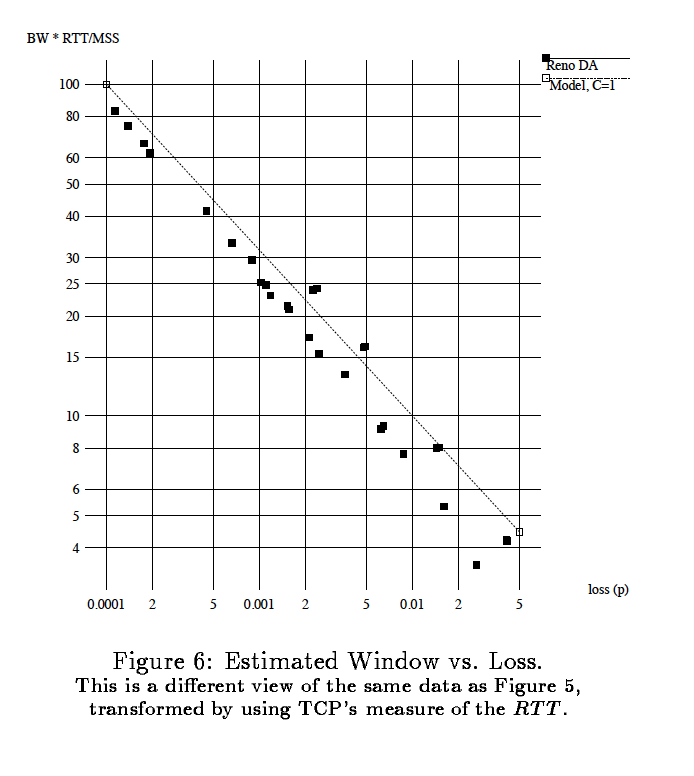
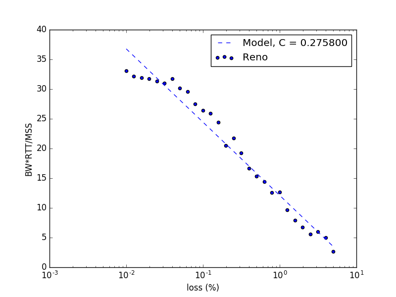
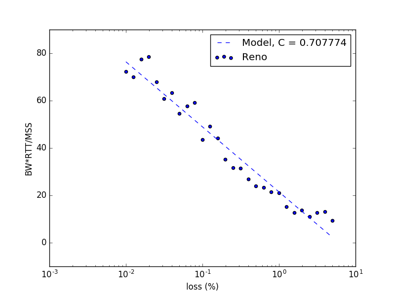
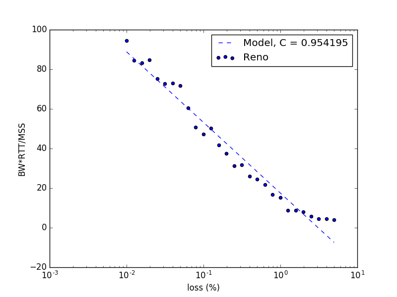

# TCP Congestion Project
## Maddie Briere and Jesse Yue
Replicating results of "The Macroscopic Behavior of the TCP Congestion Avoidance Algorithm" by Mathis et. al.

## Overview
This project seeks to reproduce the results of Mathis, Semke, and Mahdavi in the research paper *Macroscopic Behavior of the TCP Congestion Avoidance Algorithm*. Mathis et. al attempt to model the TCP congestion avoidance algorithm in order to analyze how TCP handles different behaviors in the internet, specifically problems of bandwidth allocation. The authors derive a model for TCP behavior and test it in three ways: (1) In a simulation with random packet loss, (2) Comparing the model to Internet measurements made using TReno, (3) Comparing the model to packet traces of real TCP implementations. This paper focuses on the first approach (using a simulation), and seeks to recreate *Figure 6* of the original paper (Estimated Window vs. Loss). This was accomplished using mininet to create a simple network topology and measure bandwidth & RTT under varying conditions. The results demonstrate that the theoretical model closely mirrors TCP behavior in a simulation.

## Original Figure

## Reproduced Figures

 *Queue size 5-30*

*Queue size 20-100*

*Queue size 75-100*
